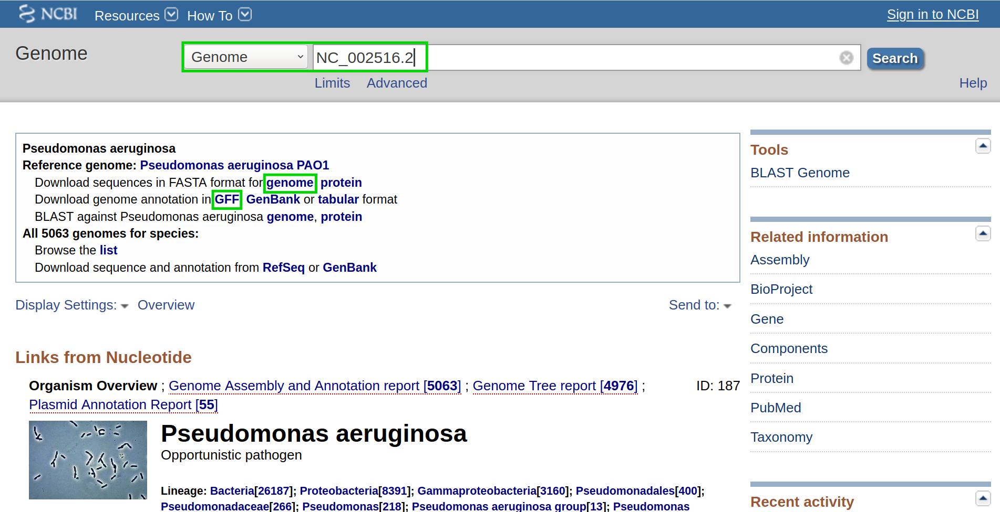

.. _example-workflow:

################
Example workflow
################

The retrieval of input files and running the workflow locally and on a server cluster via a queuing system is demonstrated using an example with data available from `NCBI  <https://www.ncbi.nlm.nih.gov/>`_.
This dataset is available under the accession number ``PRJNA379630``.

.. note:: In this tutorial, we will show the basic functionalities of our workflow, for information about additional options please refer to: :ref:`workflow-configuration <workflow-configuration:Default workflow>`.
.. note:: Ensure that you have ``miniconda3`` installed and a ``snakemake environment`` set-up. Please refer to the :ref:`overview <overview:Tools>` for details on the installation.

Setup
=====

First of all, we start by creating the project directory and changing to it.

.. code-block:: bash

    mkdir project
    cd project

We then download the latest version of HRIBO into the newly created project folder and unpack it.

.. code-block:: bash

   wget https://github.com/RickGelhausen/HRIBO/archive/1.5.1.tar.gz
   tar -xzf 1.5.1.tar.gz; mv HRIBO-1.5.1 HRIBO; rm 1.5.1.tar.gz;

Retrieve and prepare input files
================================

Before starting the workflow, we have to acquire and prepare several input files. These files are the annotation file, the genome file, the fastq files, the configuration file and the sample sheet.

Annotation and genome files
***************************

First, we want to retrieve the annotation file and the genome file. In this case, we can find both on `NCBI  <https://www.ncbi.nlm.nih.gov/genome/187?genome_assembly_id=299953>`_ using the accession number ``NC_002516.2``.

On this page, we can directly retrieve both files by clicking on the according download links next to the file descriptions. Alternatively, you can directly download them using the following commands:

.. code-block:: bash

    wget ftp://ftp.ncbi.nlm.nih.gov/genomes/all/GCF/000/006/765/GCF_000006765.1_ASM676v1/GCF_000006765.1_ASM676v1_genomic.gff.gz
    wget ftp://ftp.ncbi.nlm.nih.gov/genomes/all/GCF/000/006/765/GCF_000006765.1_ASM676v1/GCF_000006765.1_ASM676v1_genomic.fna.gz

Then, we unpack and rename both files.

.. code-block:: bash

    gunzip GCF_000006765.1_ASM676v1_genomic.gff.gz && mv GCF_000006765.1_ASM676v1_genomic.gff annotation.gff
    gunzip GCF_000006765.1_ASM676v1_genomic.fna.gz && mv GCF_000006765.1_ASM676v1_genomic.fna genome.fa

.fastq files
************

Next, we want to acquire the fastq files. The fastq files are available under the accession number ``PRJNA379630`` on `NCBI  <https://www.ncbi.nlm.nih.gov/bioproject/PRJNA379630>`_.
The files have to be downloaded using the `Sequence Read Archive (SRA)  <https://www.ncbi.nlm.nih.gov/sra/docs/>`_.
There are multiple ways of downloading files from SRA as explained `here  <https://www.ncbi.nlm.nih.gov/sra/docs/sradownload/>`_.

As we already have conda installed, the easiest way is to install the *sra-tools*:

.. code-block:: bash

    conda create -n sra-tools -c bioconda -c conda-forge sra-tools pigz

This will create a conda environment containing the sra-tools. Using these, we can simply pass the SRA identifiers and download the data:

.. code-block:: bash

    conda activate sra-tools;
    fasterq-dump SRR5356907; pigz -p 2 SRR5356907.fastq; mv SRR5356907.fastq.gz RIBO-PAO1-gly-1.fastq.gz;
    fasterq-dump SRR5356908; pigz -p 2 SRR5356908.fastq; mv SRR5356908.fastq.gz RNA-PAO1-gly-1.fastq.gz;
    conda deactivate;

.. note:: Due to the runtime of several tools, especially the mapping by ``segemehl``, this tutorial only uses one condition and replicate. If available, it is advisable to use as many replicates as possible.

.. warning:: If you have a bad internet connection, this step might take some time. If you prefer, you can also use your own ``.fastq`` files. But ensure that you use the correct annotation and genome files and that you compress them in ``.gz`` format (using gzip, pigz, etc ...)

This will download compressed files for each of the required ``.fastq`` files. We will move them into a folder called ``fastq``.

.. code-block:: bash

    mkdir fastq;
    mv *.fastq.gz fastq;

Sample sheet and configuration file
***********************************

Finally, we will prepare the configuration file (``config.yaml``) and the sample sheet (``samples.tsv``). We start by copying templates for both files from the ``HRIBO/templates/`` into the ``HRIBO/`` folder.

.. code-block:: bash

    cp HRIBO/templates/samples.tsv HRIBO/

The sample file looks as follows:

+-----------+-----------+-----------+-------------------------+
|   method  | condition | replicate | fastqFile               |
+===========+===========+===========+=========================+
| RIBO      |  A        | 1         | fastq/RIBO-A-1.fastq.gz |
+-----------+-----------+-----------+-------------------------+
| RIBO      |  A        | 2         | fastq/RIBO-A-2.fastq.gz |
+-----------+-----------+-----------+-------------------------+
| RIBO      |  B        | 1         | fastq/RIBO-B-1.fastq.gz |
+-----------+-----------+-----------+-------------------------+
| RIBO      |  B        | 2         | fastq/RIBO-B-2.fastq.gz |
+-----------+-----------+-----------+-------------------------+
| RNA       |  A        | 1         | fastq/RNA-A-1.fastq.gz  |
+-----------+-----------+-----------+-------------------------+
| RNA       |  A        | 2         | fastq/RNA-A-2.fastq.gz  |
+-----------+-----------+-----------+-------------------------+
| RNA       |  B        | 1         | fastq/RNA-B-1.fastq.gz  |
+-----------+-----------+-----------+-------------------------+
| RNA       |  B        | 2         | fastq/RNA-B-2.fastq.gz  |
+-----------+-----------+-----------+-------------------------+

.. note:: When using your own data, use any editor (vi(m), gedit, nano, atom, ...) to customize the sample sheet.
.. warning:: **Please ensure not to replace any tabulator symbols with spaces while changing this file.**

We will rewrite this file to fit the previously downloaded *.fastq.gz* files.

+-----------+-----------+-----------+--------------------------------+
|   method  | condition | replicate | fastqFile                      |
+===========+===========+===========+================================+
| RIBO      |  GLY      | 1         | fastq/RIBO-PAO1-gly-1.fastq.gz |
+-----------+-----------+-----------+--------------------------------+
| RNA       |  GLY      | 1         | fastq/RNA-PAO1-gly-1.fastq.gz  |
+-----------+-----------+-----------+--------------------------------+

Next, we are going to set up the ``config.yaml``.

.. code-block:: bash

    cp HRIBO/templates/config.yaml HRIBO/

This file contains the following variables:

* **adapter:** Specify the adapter sequence to be used. In our case this would be *AGATCGGAAGAGCACACGTCTGAACTCCAGTCAC*
* **samples:** The location of the sample sheet created in the previous step.
* **alternativestartcodons:** Specify a comma separated list of alternative start codons.
* **differentialexpression:** Specify whether you want to activate differential expresssion analysis. ("yes/no")
* **deepribo:** Specify whether you want to activate deepribo ORF prediction. ("yes/no")

In our example, this will lead to the following ``config.yaml`` file:

.. code-block:: bash

    adapter: "AGATCGGAAGAGCACACGTCTGAACTCCAGTCAC"
    samples: "HRIBO/samples.tsv"
    alternativestartcodons: "GTG,TTG"
    # Differential expression: on / off
    differentialexpression: "off"
    # Deepribo predictions: on / off
    deepribo: "off"

Running the workflow
====================

Now that all the required files are prepared, we can start running the workflow, either locally or in a cluster environment.

.. warning:: before you start using ``snakemake`` remember to activate the environment first.

.. code-block:: bash

    conda activate snakemake

Run the workflow locally
************************

Use the following steps when you plan to execute the workflow on a single server, cloud instance or workstation.

.. warning:: Please be aware that some steps of the workflow require a lot of memory or time, depending on the size of your input data. To get a better idea about the memory consumption, you can have a look at the provided ``sge.yaml`` or ``torque.yaml`` files.

Navigate to the project folder containing your annotation and genome files, as well as the HRIBO folder. Start the workflow locally from this folder by running:

.. code-block:: bash

    snakemake --use-conda -s HRIBO/Snakefile --configfile HRIBO/config.yaml --directory ${PWD} -j 10 --latency-wait 60

This will start the workflow locally.

*	``--use-conda``: instruct snakemake to download tool dependencies from conda.
*	``-s``: specifies the Snakefile to be used.
*	``--configfile``: specifies the config file to be used.
*	``--directory``: specifies your current path.
*	``-j``: specifies the maximum number of cores snakemake is allowed to use.
*	``--latency-wait``: specifies how long (in seconds) snakemake will wait for filesystem latencies until declaring a file to be missing.

Run Snakemake in a cluster environment
**************************************

Use the following steps if you are executing the workflow via a queuing system. Edit the configuration file ``<cluster>.yaml``
according to your queuing system setup and cluster hardware.

Navigate to the project folder on your cluster system. Start the workflow from this folder by running (The following system call shows the usage with Grid Engine.):

.. code-block:: bash

    snakemake --use-conda -s HRIBO/Snakefile --configfile HRIBO/config.yaml --directory ${PWD} -j 20 --cluster-config HRIBO/sge.yaml

.. note:: Ensure that you use an appropriate ``<cluster>.yaml`` for your cluster system. We provide one for ``SGE`` and ``TORQUE`` based systems.

Example: Run Snakemake in a cluster environment
***********************************************

.. warning:: **Be advised that this is a specific example, the required options may change depending on your system.**

We ran the tutorial workflow in a cluster environment, specifically a TORQUE cluster environment.
Therefore, we created a bash script ``torque.sh`` in our project folder.

.. code-block:: bash

    vi torque.sh

.. note:: Please note that all arguments enclosed in <> have to be customized. This script will only work if your cluster uses the TORQUE queuing system.

We proceeded by writing the queuing script:

.. code-block:: bash

    #!/bin/bash
    #PBS -N <ProjectName>
    #PBS -S /bin/bash
    #PBS -q "long"
    #PBS -d <PATH/ProjectFolder>
    #PBS -l nodes=1:ppn=1
    #PBS -o <PATH/ProjectFolder>
    #PBS -j oe
    cd <PATH/ProjectFolder>
    source activate HRIBO
    snakemake --latency-wait 600 --use-conda -s HRIBO/Snakefile --configfile HRIBO/config.yaml --directory ${PWD} -j 20 --cluster-config HRIBO/torque.yaml --cluster "qsub -N {cluster.jobname} -S /bin/bash -q {cluster.qname} -d <PATH/ProjectFolder> -l {cluster.resources} -o {cluster.logoutputdir} -j oe"

We then simply submitted this job to the cluster:

.. code-block:: bash

    qsub torque.sh

Using any of the presented methods, this will run the workflow on the tutorial dataset and create the desired output files.

Results
=======

The last step will be to aggregate all the results once the workflow has finished running.
In order to do this, we provided a script in the scripts folder of HRIBO called ``makereport.sh``.

.. code-block:: bash

    bash HRIBO/scripts/makereport.sh <reportname>

Running this will create a folder where all the results are collected from the workflows final output, it will additionally create compressed file in ``.zip`` format.

.. note:: A detailed explanation of the result files can be found in the :ref:`result section <analysis-results:ORF Predictions>`.

.. note:: The final result of this example workflow, can be found `here <ftp://biftp.informatik.uni-freiburg.de/pub/HRIBO/example_report_HRIBO1.5.1_28-07-21.zip>`_ .
.. warning:: As many browsers stopped the support for viewing ftp files, you might have to use a ftp viewer instead.

Runtime
=======

The total runtime of the example workflow, using 12 cores of an AMD EPYC Processor (with IBPB), 1996 MHz CPUs and 64 GB RAM, was 4h04m37s.

The runtime contains the automatic download and installation time of all dependencies by conda and singularity.
This step is mainly dependent on the available network bandwidth. In our case it took about 7 minutes.

References
==========

.. bibliography:: references.bib
