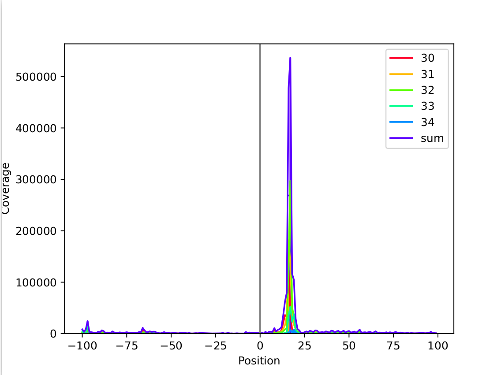
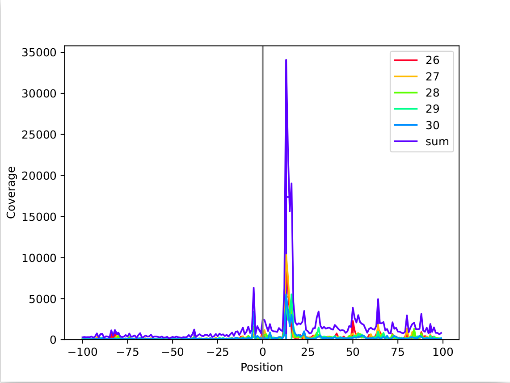
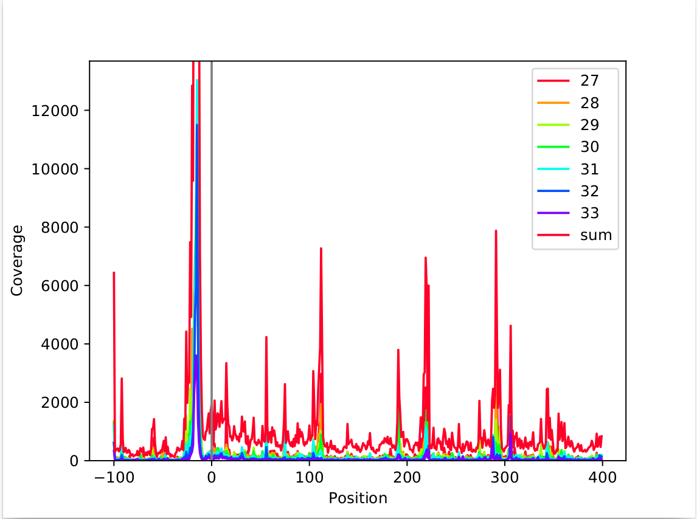

.. _metagene-profiling:

##################
Metagene profiling
##################

.. note:: Be aware that we are still actively working on our metagene profiling scripts. The main functionality is available, but the plotting scripts may be subject to further changes. Result tables in ``.tsv`` and ``.xlsx`` format are provided if you prefer using your own plotting scripts.

In this section, we describe the metagene profiling data provided by ``HRIBO``.

What is metagene profiling?
###########################

Metagene profiling analyses the distribution of mapped reads around annotated start codons and stop codons.

For Ribo-seq it is expected that the ribosome protects a specific range of
read lengths, often typical for the investigated group of organisms, from digestion
by nuclease. These reads should show a typical peak around the start codon which corresponds
to the high frequency that ribosomes are bound there.

We output and plot the metagene profiling for
each individual fragment length as a quality control for the Ribo-seq protocol. If the distribution
for all read lengths is untypical, arresting the ribosomes failed.

Metagene output
###############

We provide the possibility to analyse the metagene profiling for different coverage mapping methods.
For each sample, both the start and stop codon profiling will be performed and plotted.

Furthermore, we provide normalized (cpm, window) and unnormalized (raw) version for each sample analysed.
The normalized version takes into account the total value for each position, as well as the current window length.

The metagene profiling is done for each sample and each coverage mapping method.

* **global:** full read is mapped
* **centered:** region around the center is mapped
* **threeprime:** region around the three prime end is mapped
* **fiveprime:** region around the five prime end is mapped

For each of these sample/mapping combinations, result tables in excel ``.xlsx`` format are provided, as well as an interactive plot or several static plots.

.. note:: New filtering methods were added. For details check the :ref:`options <source/workflow-configuration:Workflow configuration>` section.

Example output
##############

.. note:: This section contains old output figures, but these are still valid as the overall method did not change.

In the following, we show a few example figure of how the results can look like.

This example shows a very sharp peak around +17nt. (mapping: threeprime)

+-------+-------+-------+-------+-------+-------+-------------+
| 30    | 31    | 32    | 33    | 34    | sum   | coordinates |
+=======+=======+=======+=======+=======+=======+=============+
| ...   | ...   | ...   | ...   | ...   | ...   | ...         |
+-------+-------+-------+-------+-------+-------+-------------+
| 1321  | 1242  | 1269  | 773   | 92    | 4697  | 11          |
+-------+-------+-------+-------+-------+-------+-------------+
| 1564  | 1193  | 1358  | 624   | 172   | 4911  | 12          |
+-------+-------+-------+-------+-------+-------+-------------+
| 4272  | 2317  | 1659  | 906   | 125   | 9279  | 13          |
+-------+-------+-------+-------+-------+-------+-------------+
| 6870  | 3009  | 1814  | 738   | 91    | 12522 | 14          |
+-------+-------+-------+-------+-------+-------+-------------+
| 6214  | 7498  | 2733  | 1265  | 140   | 17850 | 15          |
+-------+-------+-------+-------+-------+-------+-------------+
| 17797 | 27399 | 28398 | 13322 | 1245  | 88161 | 16          |
+-------+-------+-------+-------+-------+-------+-------------+
| 7686  | 22687 | 62042 | 25575 | 5427  | 123417| 17          |
+-------+-------+-------+-------+-------+-------+-------------+
| 1272  | 5200  | 11156 | 11202 | 1382  | 30212 | 18          |
+-------+-------+-------+-------+-------+-------+-------------+
| 1584  | 3520  | 10027 | 22530 | 5325  | 42986 | 19          |
+-------+-------+-------+-------+-------+-------+-------------+
| 792   | 2166  | 2636  | 5044  | 1969  | 12607 | 20          |
+-------+-------+-------+-------+-------+-------+-------------+
| 176   | 568   | 1082  | 931   | 307   | 3064  | 21          |
+-------+-------+-------+-------+-------+-------+-------------+
| 233   | 321   | 930   | 1102  | 219   | 2805  | 22          |
+-------+-------+-------+-------+-------+-------+-------------+
| 204   | 211   | 270   | 378   | 89    | 1152  | 23          |
+-------+-------+-------+-------+-------+-------+-------------+
| ...   | ...   | ...   | ...   | ...   | ...   | ...         |
+-------+-------+-------+-------+-------+-------+-------------+

The tables give a better overview over the data, showing that the highest peak is found at +17 for a read length of 32nt.

In this example the peak is less sharp, but it is still clearly distinguishable and around +13nt. (mapping: threeprime)

+-------+-------+-------+-------+-------+-------+-------------+
| 26    | 27    | 28    | 29    | 30    | sum   | coordinates |
+=======+=======+=======+=======+=======+=======+=============+
| ...   | ...   | ...   | ...   | ...   | ...   | ...         |
+-------+-------+-------+-------+-------+-------+-------------+
| 294   | 308   | 198   | 297   | 321   | 1418  | 9           |
+-------+-------+-------+-------+-------+-------+-------------+
| 177   | 338   | 204   | 170   | 286   | 1175  | 10          |
+-------+-------+-------+-------+-------+-------+-------------+
| 217   | 236   | 248   | 164   | 162   | 1027  | 11          |
+-------+-------+-------+-------+-------+-------+-------------+
| 2545  | 804   | 976   | 1379  | 548   | 6252  | 12          |
+-------+-------+-------+-------+-------+-------+-------------+
| 8593  | 10334 | 5286  | 4359  | 5519  | 34091 | 13          |
+-------+-------+-------+-------+-------+-------+-------------+
| 6120  | 7662  | 3238  | 2403  | 3590  | 23013 | 14          |
+-------+-------+-------+-------+-------+-------+-------------+
| 3416  | 4134  | 3807  | 2633  | 1643  | 15633 | 15          |
+-------+-------+-------+-------+-------+-------+-------------+
| 1311  | 4097  | 5079  | 5528  | 3020  | 19035 | 16          |
+-------+-------+-------+-------+-------+-------+-------------+
| 270   | 340   | 1086  | 1682  | 1222  | 4600  | 17          |
+-------+-------+-------+-------+-------+-------+-------------+
| 202   | 282   | 269   | 632   | 761   | 2146  | 18          |
+-------+-------+-------+-------+-------+-------+-------------+
| ...   | ...   | ...   | ...   | ...   | ...   | ...         |
+-------+-------+-------+-------+-------+-------+-------------+

This table shows a situation that is less clear, the offset at +13 for read length 27nt is the highest, while it is very close to the surounding values.

The metagene analysis is very dependant on the analysed data. We have observed cases with multiple peaks, with one large peak and a few slightly smaller peaks.

This shows a case with a strong peak at around -15nt, while there are multiple smaller peaks at -22, +112, +219, and +291.
These kinds of peaks can have multiple reasons. Reasons we observed so far were:

* tRNA or rRNA that was not filtered out correctly
* singular genes that have a large number of reads attributed to them (due to a biological reason or a faulty sequencing)

