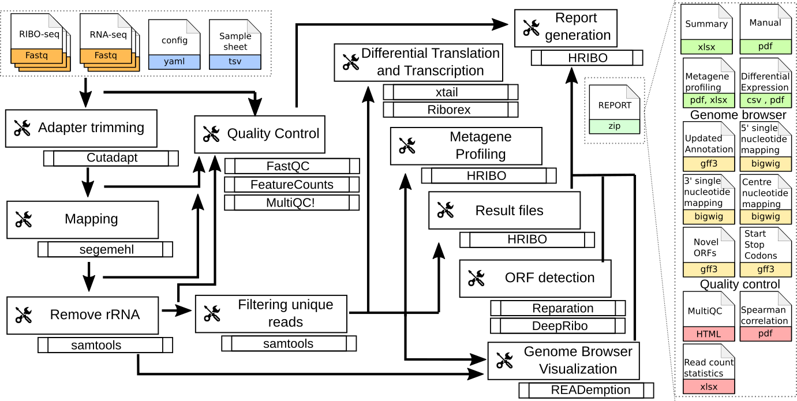

#####
HRIBO
#####

Introduction
============

HRIBO is a workflow for the analysis of prokaryotic Ribo-Seq data. HRIBO is available on `github <https://github.com/RickGelhausen/HRIBO>`_. It includes among others, prediction of novel open reading frames (**ORFs**), metagene profiling, quality control and differential expression analysis. The workflow is based on the workflow management system **snakemake** and handles installation of all dependencies via `bioconda <https://bioconda.github.io/>`_ :cite:`GRU:KOE:2018` and `docker <https://www.docker.com/>`_, as well as all processings steps. The source code of HRIBO is open source and available under the License **GNU General Public License 3**. Installation and basic usage is described below.

.. note:: For a detailed step by step tutorial on how to use this workflow on a sample dataset, please refer to our :ref:`example-workflow <example-workflow:Example workflow>`.

Program flowchart
=================

The following flowchart describes the processing steps of the workflow and how they are connected:

Requirements
============

In the following, we describe all the required files and tools needed to run our workflow.

Tools
=====

miniconda3
**********

As this workflow is based on the workflow management system  `snakemake <https://snakemake.readthedocs.io/en/stable/>`_ :cite:`KOE:RAH:2018Snakemake`, **Snakemake** will download all necessary dependencies via `conda <https://conda.io/projects/conda/en/latest/user-guide/install/index.html>`_.

We strongly recommend installing `miniconda3 <https://conda.io/miniconda.html>`_ with ``python3.7``.

After downloading the ``miniconda3`` version suiting your linux system, execute the downloaded bash file and follow the instructions given.

snakemake
*********

.. note:: HRIBO requires ``snakemake (version>=5.5.1)``

The newest version of ``snakemake`` as well as the ``squashfs-tools`` required for ``singularity`` can be downloaded via conda using the following command:

.. code-block:: bash

    conda create -c conda-forge -c bioconda -n snakemake snakemake squashfs-tools

This creates a new conda environment called ``snakemake`` and installs ``snakemake`` into the environment. The environment can be activated using:

.. code-block:: bash

    conda activate snakemake

and deactivated using:

.. code-block:: bash

    conda deactivate

singularity
***********

.. warning:: This dependency is only required if you intend to use the prediction tool ``deepribo``. The rest of the workflow does not require ``singularity``. ``deepribo`` is deactivated by default. For more details on activating ``deepribo``, please refer to :ref:`Activating DeepRibo <workflow-configuration:Activating DeepRibo>`.

In order to support `docker container <https://www.docker.com/>`_, snakemake requires `singularity <https://sylabs.io/docs/>`_.
This is used to retrieve tools that are not available on conda as of now.

An in-depth installation tutorial for singularity can be found on the `singularity webpage <https://sylabs.io/guides/3.0/user-guide/installation.html>`_.

.. note:: we strongly suggest to install the newest version of singularity. We tested our worklow on ``singularity v3.4.2``.

HRIBO
*****

Using the workflow requires ``HRIBO``. The latest version is available on our GitHub page.

In order to run the workflow, we suggest that you download the ``HRIBO`` into your project directory.
The following command creates an example directory and changes into it:

.. code-block:: bash

    mkdir project
    cd project

Now, download and unpack the latest version of ``HRIBO`` by entering the following commands:

.. code-block:: bash

    wget https://github.com/RickGelhausen/HRIBO/archive/1.4.4.tar.gz
    tar -xzf 1.4.4.tar.gz; mv HRIBO-1.4.4 HRIBO; rm 1.4.4.tar.gz;

``HRIBO`` is now in a subdirectory of your project directory.

Input files
===========

Several input files are required in order to run the workflow, a genome file (``.fa``), an annotation file (``.gff/.gtf``) and compressed sequencing files (``.fastq.gz``).

+-------------------------------------------+----------------------------------------------------------------------------------------------+
| File name                                 | Description                                                                                  |
+===========================================+==============================================================================================+
| annotation.gff                            | user-provided annotation file with genomic features                                          |
+-------------------------------------------+----------------------------------------------------------------------------------------------+
| genome.fa                                 | user-provided genome file containing the genome sequence                                     |
+-------------------------------------------+----------------------------------------------------------------------------------------------+
| <method>-<conditon>-<replicate>.fastq.gz  | user-provided compressed sequencing files                                                    |
+-------------------------------------------+----------------------------------------------------------------------------------------------+
| config.yaml                               | configuration file to customize the workflow                                                 |
+-------------------------------------------+----------------------------------------------------------------------------------------------+
| samples.tsv                               | sample file describing the relation between the input fastq files                            |
+-------------------------------------------+----------------------------------------------------------------------------------------------+

annotation.gff and genome.fa
****************************

We recommend retrieving both the genome and the annotation files for your organism from `National Center for Biotechnology Information (NCBI)  <https://www.ncbi.nlm.nih.gov/>`_ or `Ensembl Genomes <http://ensemblgenomes.org/>`_ :cite:`Ensembl:2018`.

.. warning:: if you use custom annotation files, ensure that you adhere to the gtf/gff standard. Wrongly formatted files are likely to cause problems with downstream tools.

.. note:: For detailed information about downloading and unpacking these files, please refer to our :ref:`example-workflow <example-workflow:Example workflow>`.

input .fastq files
******************

These are the input files provided by the user.
Both single end and paired end data is supported.

.. note:: As most downstream tools do not support paired end data, we combine the paired end data into single end data using `flash2 <https://github.com/dstreett/FLASH2>`_ . For more information about how to use paired-end data please refer to the :ref:`workflow-configuration <workflow-configuration:Paired-end support>`.
.. note:: Please ensure that you compress your files in ``.gz`` format.

Please ensure that you move all input ``.fastq.gz`` files into a folder called **fastq** (Located in your project folder):

.. code-block:: bash

    mkdir fastq
    cp *.fastq.gz fastq/

Sample sheet and configuration file
***********************************

In order to run ``HRIBO``, you have to provide a sample sheet and a configuration file.
There are templates for both files available in the ``HRIBO`` folder, in the subfolder ``templates``.
The configuration file is used to allow the user to easily customize certain settings, like the adapter sequence.
The sample sheet is used to specify the relation of the input ``.fastq`` files (condition / replicate etc...)

Copy the templates of the sample sheet and the configuration file into the ``HRIBO`` folder:

.. code-block:: bash

    cp HRIBO/templates/samples.tsv HRIBO/
    cp HRIBO/templates/config.yaml HRIBO/

Customize the ``config.yaml`` using your preferred editor. It contains the following variables:

•	**adapter:** specify the adapter sequence to be used.
•	**samples:** the location of the samples sheet created in the previous step.
• **alternativestartcodons:** specify a comma separated list of alternative start codons.
• **differentialexpression:** specify whether you want to activate differential expresssion analysis. ("yes/no")
• **deepribo:** specify whether you want to activate deepribo ORF prediction. ("yes/no")

Edit the sample sheet corresponding to your project. It contains the following variables:

• **method:** indicates the method used for this project, here RIBO for ribosome profiling and RNA for RNA-seq.
• **condition:** indicates the applied condition (e.g. A, B, ...).
• **replicate:** ID used to distinguish between the different replicates (e.g. 1,2, ...)
• **inputFile:** indicates the according fastq file for a given sample.

.. note:: If you have paired end data, please ensure that you use the ``samples_pairedend.tsv`` file.

As seen in the ``samples.tsv`` template:

+-----------+-----------+-----------+-------------------------+
|   method  | condition | replicate | fastqFile               |
+===========+===========+===========+=========================+
| RIBO      |  A        | 1         | fastq/RIBO-A-1.fastq.gz |
+-----------+-----------+-----------+-------------------------+
| RIBO      |  A        | 2         | fastq/RIBO-A-2.fastq.gz |
+-----------+-----------+-----------+-------------------------+
| RIBO      |  B        | 1         | fastq/RIBO-B-1.fastq.gz |
+-----------+-----------+-----------+-------------------------+
| RIBO      |  B        | 2         | fastq/RIBO-B-2.fastq.gz |
+-----------+-----------+-----------+-------------------------+
| RNA       |  A        | 1         | fastq/RNA-A-1.fastq.gz  |
+-----------+-----------+-----------+-------------------------+
| RNA       |  A        | 2         | fastq/RNA-A-2.fastq.gz  |
+-----------+-----------+-----------+-------------------------+
| RNA       |  B        | 1         | fastq/RNA-B-1.fastq.gz  |
+-----------+-----------+-----------+-------------------------+
| RNA       |  B        | 2         | fastq/RNA-B-2.fastq.gz  |
+-----------+-----------+-----------+-------------------------+

.. note:: This is just an example, please refer to our :ref:`example-workflow <example-workflow:Example workflow>` for another example.

cluster.yaml
************

In the ``HRIBO`` folder, we provide two ``<cluster>.yaml`` files needed by snakemake in order to run on a cluster system:

• **sge.yaml** - for grid based queuing systems
• **torque.yaml** - for torque based queuing systems

Output files
============

In the following tables all important output files of the workflow are listed.

.. note:: Files create as intermediate steps of the workflow are omitted from this list. (e.g. ``.bam`` files)
.. note:: For more details about the output files, please refer to the :ref:`analysis results <analysis-results:Analysis result files>`.

Single-file Output
******************

+-------------------------------------------+---------------------------------------------------------------------------------------------------------------------------------------+
| File name                                 | Description                                                                                                                           |
+===========================================+=======================================================================================================================================+
| samples.xlsx                              | Excel version of the input samples file.                                                                                              |
+-------------------------------------------+---------------------------------------------------------------------------------------------------------------------------------------+
| manual.pdf                                | A PDF file describing the analysis.                                                                                                   |
+-------------------------------------------+---------------------------------------------------------------------------------------------------------------------------------------+
| annotation_total.xlsx                     | Excel file containing detailed measures for every feature in the input annotation using read counts containing multi-mapping reads.   |
+-------------------------------------------+---------------------------------------------------------------------------------------------------------------------------------------+
| annotation_unique.xlsx                    | Excel file containing detailed measures for every feature in the input annotation using read counts containing no multi-mapping reads.|
+-------------------------------------------+---------------------------------------------------------------------------------------------------------------------------------------+
| total_read_counts.xlsx                    | Excel file containing read counts with multi-mapping reads.                                                                           |
+-------------------------------------------+---------------------------------------------------------------------------------------------------------------------------------------+
| unique_read_counts.xlsx                   | Excel file containing read counts without multi-mapping reads.                                                                        |
+-------------------------------------------+---------------------------------------------------------------------------------------------------------------------------------------+
| multiqc_report.html                       | Quality control report combining all finding of individual fastQC reports into a well structured overview file.                       |
+-------------------------------------------+---------------------------------------------------------------------------------------------------------------------------------------+
| heatmap_SpearmanCorr_readCounts.pdf       | PDF file showing the Spearman correlation between all samples.                                                                        |
+-------------------------------------------+---------------------------------------------------------------------------------------------------------------------------------------+
| predictions_reparation.xlsx               | Excel file containing detailed measures for every ORF detected by reparation.                                                         |
+-------------------------------------------+---------------------------------------------------------------------------------------------------------------------------------------+
| predictions_reparation.gff                | GFF file containing ORFs detected by reparation, for genome browser visualization.                                                    |
+-------------------------------------------+---------------------------------------------------------------------------------------------------------------------------------------+
| potentialStartCodons.gff                  | GFF file for genome browser visualization containing all potential start codons in the input genome.                                  |
+-------------------------------------------+---------------------------------------------------------------------------------------------------------------------------------------+
| potentialStopCodons.gff                   | GFF file for genome browser visualization containing all potential stop codons in the input genome.                                   |
+-------------------------------------------+---------------------------------------------------------------------------------------------------------------------------------------+
| potentialRibosomeBindingSite.gff          | GFF file for genome browser visualization containing all potential ribosome binding sites in the input genome.                        |
+-------------------------------------------+---------------------------------------------------------------------------------------------------------------------------------------+
| potentialAlternativeStartCodons.gff       | GFF file for genome browser visualization containing all potential alternative start codons in the input genome.                      |
+-------------------------------------------+---------------------------------------------------------------------------------------------------------------------------------------+

Multi-file Output
*****************
+-------------------------------------------+---------------------------------------------------------------------------------------------------------------------------------------+
| File name                                 | Description                                                                                                                           |
+===========================================+=======================================================================================================================================+
| riborex/<contrast>_sorted.csv             | Differential expression results by Riborex, sorted by pvalue.                                                                         |
+-------------------------------------------+---------------------------------------------------------------------------------------------------------------------------------------+
| riborex/<contrast>_significant.csv        | Differential expression results by Riborex, only significant results. (pvalue < 0.05)                                                 |
+-------------------------------------------+---------------------------------------------------------------------------------------------------------------------------------------+
| xtail/<contrast>_sorted.csv               | Differential expression results by xtail, sorted by pvalue.                                                                           |
+-------------------------------------------+---------------------------------------------------------------------------------------------------------------------------------------+
| xtail/<contrast>_significant.csv          | Differential expression results by xtail, only significant results. (pvalue < 0.05)                                                   |
+-------------------------------------------+---------------------------------------------------------------------------------------------------------------------------------------+
| xtail/r_<contrast>.pdf                    | Differential expression results by xtail, plot with RPF-to-mRNA ratios.                                                               |
+-------------------------------------------+---------------------------------------------------------------------------------------------------------------------------------------+
| xtail/fc_<contrast>.pdf                   | Differential expression results by xtail, plot with log2 fold change of both mRNA and RPF.                                            |
+-------------------------------------------+---------------------------------------------------------------------------------------------------------------------------------------+
| <method>-<condition>-<replicate>.X.Y.Z.bw | BigWig file for genome browser visualization, containing a single nucleotide mapping around certain regions.                          |
+-------------------------------------------+---------------------------------------------------------------------------------------------------------------------------------------+
| <accession>_Z.Y_profiling.xlsx/tsv        | Excel and tsv files containing raw data of the metagene analysis.                                                                     |
+-------------------------------------------+---------------------------------------------------------------------------------------------------------------------------------------+
| <accession>_Z.Y_profiling.pdf             | visualization of the metagene analysis.                                                                                               |
+-------------------------------------------+---------------------------------------------------------------------------------------------------------------------------------------+

.. note:: <contrast> represents a pair of conditions that are being compared.
.. note:: The BigWig files are available for different normalization methods, strands and regions, X=(min/mil) Y=(forward/reverse) Z=(fiveprime, threeprime, global, centered).

Tool Parameters
===============

The tools used in our workflow are listed below, with links to their respective webpage and a short description.

+-------------------------------------------------------------------------+-------------+---------------------------------------------------------------------+
| Tool                                                                    | Version     | Special parameters used                                             |
+=========================================================================+=============+=====================================================================+
| `cutadapt <https://cutadapt.readthedocs.io/en/stable/>`_                | 2.1         | Adapter removal and quality trimming                                |
+-------------------------------------------------------------------------+-------------+---------------------------------------------------------------------+
| `fastQC <https://www.bioinformatics.babraham.ac.uk/projects/fastqc/>`_  | 0.11.9      | Quality control                                                     |
+-------------------------------------------------------------------------+-------------+---------------------------------------------------------------------+
| `multiQC <https://multiqc.info/>`_                                      | 1.8         | Quality control report                                              |
+-------------------------------------------------------------------------+-------------+---------------------------------------------------------------------+
| `segemehl <https://www.bioinf.uni-leipzig.de/Software/segemehl/>`_      | 0.3.4       | Mapping of reads                                                    |
+-------------------------------------------------------------------------+-------------+---------------------------------------------------------------------+
| `flash2 <https://github.com/dstreett/FLASH2>`_                          | 2.2.00      | Merging paired end samples into single end                          |
+-------------------------------------------------------------------------+-------------+---------------------------------------------------------------------+
| `cufflinks <http://cole-trapnell-lab.github.io/cufflinks/>`_            | 2.2.1       | Used to convert gff to gtf                                          |
+-------------------------------------------------------------------------+-------------+---------------------------------------------------------------------+
| `bedtools <https://bedtools.readthedocs.io/en/latest/>`_                | 2.27.1      | Collection of useful processing tools (e.g. read counting etc...)   |
+-------------------------------------------------------------------------+-------------+---------------------------------------------------------------------+
| `reparation_blast <https://github.com/RickGelhausen/REPARATION_blast>`_ | 1.0.9       | Prediction of novel Open Reading frames                             |
+-------------------------------------------------------------------------+-------------+---------------------------------------------------------------------+
| `deepribo <https://github.com/Biobix/DeepRibo>`_                        | 1.1         | Prediction of novel Open Reading frames                             |
+-------------------------------------------------------------------------+-------------+---------------------------------------------------------------------+
| `riborex <https://github.com/smithlabcode/riborex>`_                    | 2.4.0       | Differential expression analysis                                    |
+-------------------------------------------------------------------------+-------------+---------------------------------------------------------------------+
| `xtail <https://github.com/xryanglab/xtail>`_                           | 1.1.5       | Differential expression analysis                                    |
+-------------------------------------------------------------------------+-------------+---------------------------------------------------------------------+

Report
======

In order to aggregate the final results into a single folder structure and receive a date-tagged ``.zip`` file, you can use the ``makereport.sh`` script.

.. code-block:: bash

    bash HRIBO/scripts/makereport.sh <reportname>

.. note:: Examples of how this output can look are available `here <ftp://biftp.informatik.uni-freiburg.de/pub/HRIBO/examplereport_HRIBO1.3.2_14-02-20.zip>`_ .

Example-workflow
================

A detailed step by step tutorial is available at: :ref:`example-workflow <example-workflow:Example workflow>`.

References
==========

.. bibliography:: references.bib
